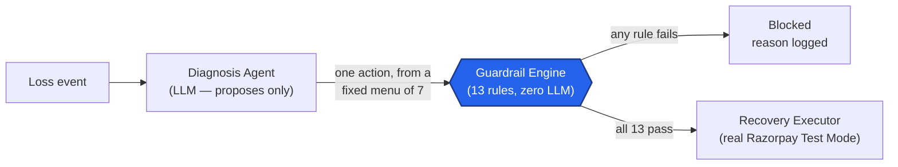
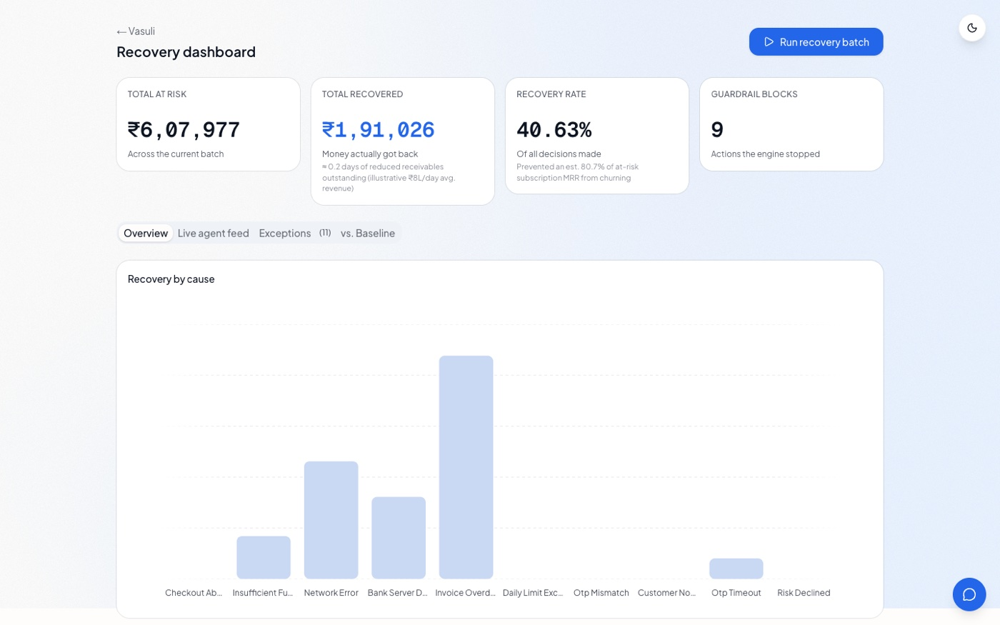
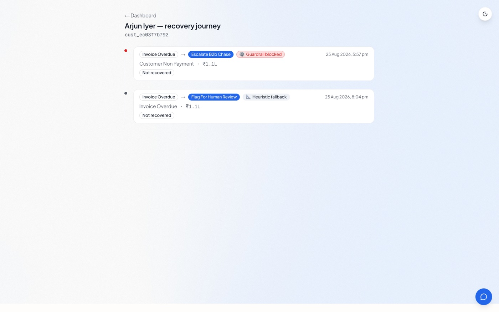
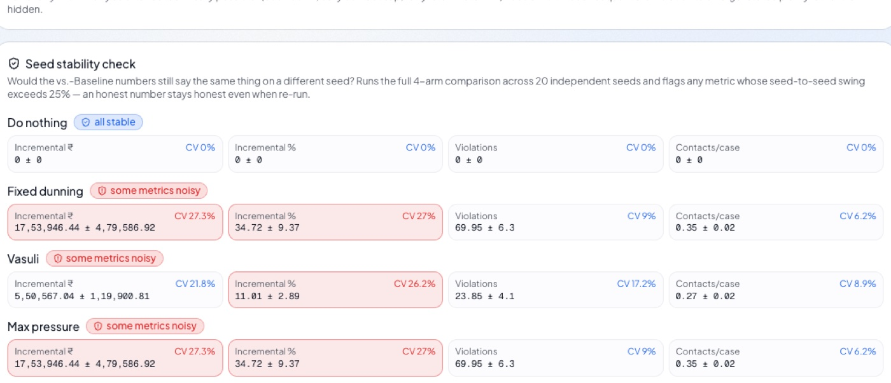
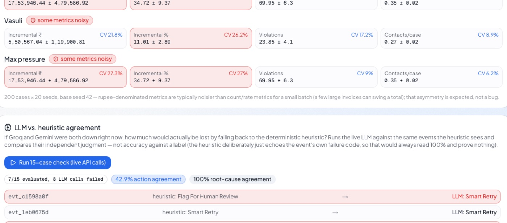

# Building Vasuli: an AI agent that isn't allowed to touch money

*A build log for Razorpay's AI Buildathon, Track 03 — AI Revenue Recovery.*

## The problem, in one sentence

Money doesn't leave a business in one clean step. A card payment gets
declined for a dozen different reasons. A customer opens checkout, sees the
total, and vanishes. A subscription mandate quietly expires. A B2B invoice
sits unpaid for eleven days because nobody followed up. Track 03's brief
was to build an agent that closes the loop on all four — detect it, figure
out *why*, do something bounded about it, and prove with real numbers that
it actually worked.

The track's own bar was explicit: *"don't just identify the problem — show
measured money recovered across a batch, with compliant escalation,
stopping rules, and an audit trail."* That sentence is the whole design
brief. Everything below is in service of it.

## The one decision everything else follows from

The single most important architectural choice in this project happened
before a line of the diagnosis prompt was written: **the LLM never touches
money directly.**

An AI model can be extremely good at reading a failure event and figuring
out *why* it happened. It is a much worse choice for deciding, unsupervised,
whether it's actually okay to retry someone's card for the third time this
week, or to send them a WhatsApp message at 11pm, or to escalate a ₹2 lakh
invoice without a human ever seeing it. Those aren't judgment calls — they're
policy, and policy should be code you can read, test, and trust completely.

So the system is split into two halves with a hard wall between them:

The LLM (Groq, with Gemini as an automatic fallback) gets the full context
of one event — the failure reason, attempt history, customer profile — and
picks exactly **one** action from a fixed menu of seven: retry the payment,
generate a fresh payment link, send a nudge, chase a B2B invoice, request a
mandate re-auth, flag for human review, or recommend no action at all. It
can never invent an eighth option. Its output is structured JSON via
tool-calling, never free text, so every decision is machine-checkable.

That proposal then hits 13 plain Python functions — no AI, no model call,
nothing non-deterministic — checking things like retry caps, contact-hour
windows, opt-out status, and an economic stopping rule that blocks an action
outright if the expected recovery doesn't clear 3× its cost. Every single
check runs on every decision, and every result — pass *and* fail — gets
written to the audit trail. Only if all 13 pass does a third layer,
`executors.py`, get to actually do anything.

*Every decision's full trace — the diagnosis, all 13 checks, the action
taken, the outcome. Nothing here is a black box.*

## What happens when Groq is down

Free-tier LLM APIs rate-limit. During actual development — not a
hypothetical — Groq briefly returned malformed tool-call JSON while
Gemini's free daily quota was simultaneously exhausted. A system that just
crashes there, or silently does nothing, isn't demo-ready. Vasuli degrades
in three steps: Groq → Gemini → a small, explicit, zero-API-key rule-based
diagnosis function (`heuristic_agent.py`) that picks from the *exact same*
allowed action set as the LLM. Every fallback event is logged, whichever
level it happens at. The whole app can run a full batch with zero live API
keys and still produce structured, guardrail-checked decisions.

*The dashboard — KPI row (with the cash-flow-language subtext under each
number), recovery-by-cause and recovery-over-time charts, computed live
from whatever batch is currently on record.*

## Proving it actually helps — not just that it runs

A recovery agent can look impressive by pointing at a "recovery rate"
number that's mostly not its own doing. Some fraction of at-risk money
comes back with *zero* intervention — a customer retries their own card, a
reliable business pays its invoice a few days late regardless of whether
anyone chased it. Counting that as the agent's win is the easiest way for a
recovery product to flatter itself.

So the evaluation harness runs the same batch of synthetic cases through
four policies — `do_nothing`, a naive `fixed_dunning` ladder with no
guardrails, `vasuli` (the real guardrail engine), and a `max_pressure`
policy that ignores guardrails entirely — using **common random numbers**:
every case gets one pre-drawn outcome seed used identically across all four
arms, so a case that "gets lucky" gets lucky in every policy. Differences
between arms are attributable to the policy, not noise.

The headline number is **incremental recovery** —
`recovered_under_policy − recovered_under_do_nothing` — not raw recovery.
The honest reading of the comparison: a policy that acts on every case
regardless of consequences recovers more raw ₹, but at roughly 3–4× the
guardrail violations. Vasuli trades some of that raw recovery for a large,
quantified reduction in compliance violations and a lower cost per case.
That trade-off is the actual story, reported plainly instead of hidden
behind one flattering "recovery rate" number.

## The counterfactual sandbox — the feature I'm most proud of

Every safety claim in this README is easy to *say*. It's much more
convincing to let someone try to break it, live, in the app. That's what
the counterfactual sandbox does: on any decision's detail view, pick a
*different* action than the one the agent actually chose, and it runs
through the real, live guardrail engine — same code path, same customer
contact history, same time of day — no duplicated logic, no canned example.

*Picking "Smart Retry" again on an event that had already been retried once
— the sandbox correctly catches it against the real 30-minute retry rate
limit, live, and shows exactly which rule blocked it.*

Nothing here ever actually re-executes or hits Razorpay for real — it's
labeled a simulated projection throughout — but the guardrail verdict
itself is 100% real.

## The 2am bug

Every real build has a story like this, and hiding it is worse than telling
it. An early version of the retry executor shipped with **no rate limit**.
During testing, batch runs seconds apart meant the same customer's failed
`insufficient_funds` payment got retried over and over. Real payment
networks treat rapid repeat retries as suspicious and start soft-declining
them — so the retry itself was making recovery *worse*, not better. A
system quietly sabotaging its own numbers.

It wasn't found by staring at code. It was found by reading the system's
own audit trail: every retry attempt logged `passed: true` on every
guardrail check — because no rule existed yet to catch the pattern — and
the outcome log showed the same payment's decline reason flipping to
`risk_declined` after several rapid attempts. The system's own honesty
mechanism surfaced its own bug.

The fix was a guardrail, not a prompt tweak: a 30-minute per-payment retry
rate limit and a 4-hour cross-channel cool-down, both permanent rules in
the guardrail table today, plus an explicit `rate_limited` reason so this
class of failure is visible in the audit trail if it ever happens again.
The fix lives in deterministic code — the layer that's actually trusted for
correctness — not in a system prompt that could silently regress.

A second, smaller bug surfaced the same way: the evaluation harness's
reproducibility depended on `random.seed()`, but event IDs were generated
with `uuid.uuid4()` — which completely ignores that seed. Running the exact
same `--seed 42` comparison twice produced two *different* reports,
quietly defeating the entire point of a reproducible baseline comparison.
Fixed by switching ID generation to Python's seeded `random` module.
Verified by literally running the same command twice and diffing the
output byte-for-byte.

## Everything above the guardrail line

Six features exist specifically to make the safety architecture *visible*,
not just true:

- **Decision-source badges** (🤖 AI-proposed / ⚙️ guardrail-blocked / 📐 heuristic-fallback) on every single decision, everywhere it renders — the "LLM never touches money" claim is something a judge can verify by scrolling, not something they have to take on faith.
- **A live pause/resume kill switch** that answers "what happens if this needs to stop right now" as a moment in the demo instead of a line in a doc.
- **Cash-flow framing** — the same recovered-₹ number restated as "≈N days of reduced receivables outstanding," the sentence a CFO actually says out loud.
- **A per-customer recovery journey** — the same underlying decision data, told as a timeline instead of a flat table row, because "watch one customer's payment get rescued, step by step" is a stronger story than "here's a table."

  

- **The counterfactual sandbox**, above.
- **A fairness/consistency check** comparing whether the agent treats customers differently by language preference, channel, or tenure — reported honestly either way, "no evidence of differential treatment" if that's what the data shows, the honest opposite if not.

## Three more, built after reading what everyone else in this track shipped

Late in the build, I read through 11 other public repos in the same
track. Two were genuinely strong — one had a randomized-holdout eval with
confidence intervals, the other had a hash-chained ledger with a
`replay()` function. Most of the rest were either off-brief, unfinished
stubs, or made one very avoidable mistake: a "diagnosis accuracy" eval
that would score 100% forever without measuring anything, because it
compared a deterministic fallback against the exact label it was built to
echo. Three things came out of that read:

**A 13th guardrail rule: promise-to-pay.** If a B2B customer already told
the merchant "I'll pay by Friday," chasing them again before Friday
undermines the trust the chase sequence exists to protect — so the rule
defers. But the moment that promised date passes with no payment, the
rule flips and explicitly *allows* escalation again, rather than staying
quiet forever. Without that second half, a customer could stall
indefinitely by promising once and never paying — the asymmetry is the
entire point.

**A seed-stability check**, because a single reproducible number isn't
the same as a *representative* one. It re-runs the full 4-policy
comparison across 20 independent seeds and automatically flags any
metric whose seed-to-seed swing exceeds a stated 25% threshold — live on
the dashboard, not a paragraph someone has to go looking for.

*A real run: rupee totals for `fixed_dunning` and `max_pressure` swing
27% seed to seed — flagged "noisy" automatically — while counts and rates
stay well within the stable band. The honest asymmetry is the finding.*

**An LLM-vs-heuristic agreement check** — deliberately *not* "diagnosis
accuracy," because that metric is meaningless on this codebase: the
heuristic fallback intentionally just echoes the event's own failure
code rather than re-deriving it, so scoring it against that same code
would read 100% forever and prove nothing. The real question is how
often the *live* LLM's independent judgment agrees with the deterministic
fallback — which directly answers "if both providers went down right
now, how much would actually be lost?"

*A real run, reported as-is: 7 of 15 cases evaluated (8 hit a live rate
limit — itself an honest artifact of a free-tier API, not hidden), 42.9%
action agreement, 100% root-cause agreement. Genuine disagreements
showed up (the LLM picked Smart Retry where the heuristic flagged for
human review) — exactly the kind of finding this check exists to surface,
not a number tuned to look good.*

## What's next

The pipeline runs end-to-end against real infrastructure — real Razorpay
Test Mode payment links, a real hash-chained Postgres audit trail, real
Supabase Realtime streaming to the dashboard — covered by 136 passing
tests, and now deployed and reachable at
**[vasuli-ai.vercel.app](https://vasuli-ai.vercel.app)**. What's left is
recording the pitch video — genuinely just execution at this point, not
an open design question.

Live demo: **[vasuli-ai.vercel.app](https://vasuli-ai.vercel.app)**.
Full technical reference: **[docs/architecture.md](docs/architecture.md)**.
Source: **[github.com/ChachanNaman/vasuli-ai](https://github.com/ChachanNaman/vasuli-ai)**.
