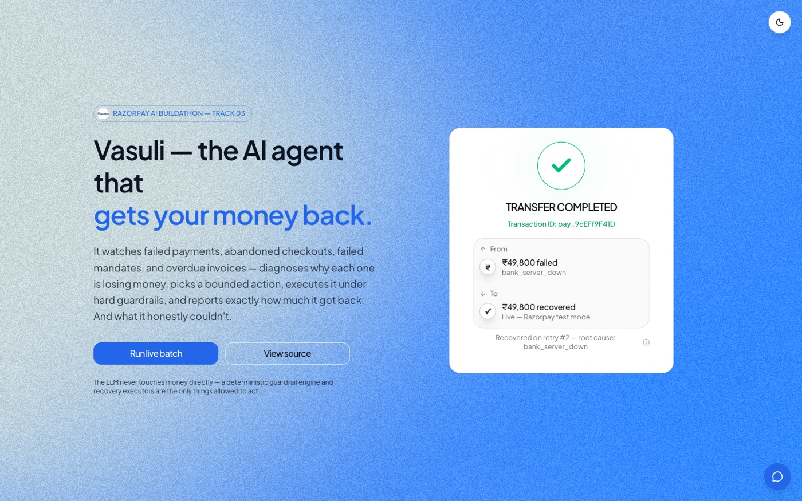
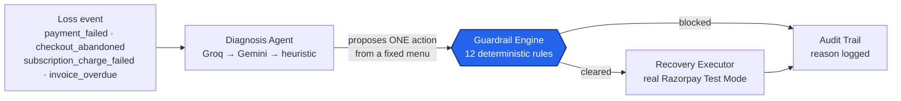
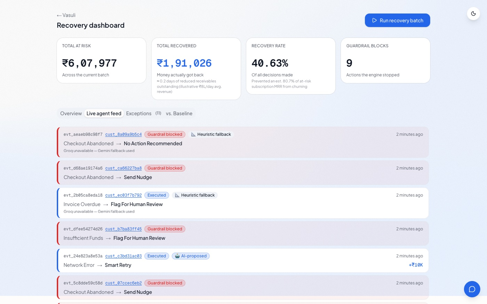
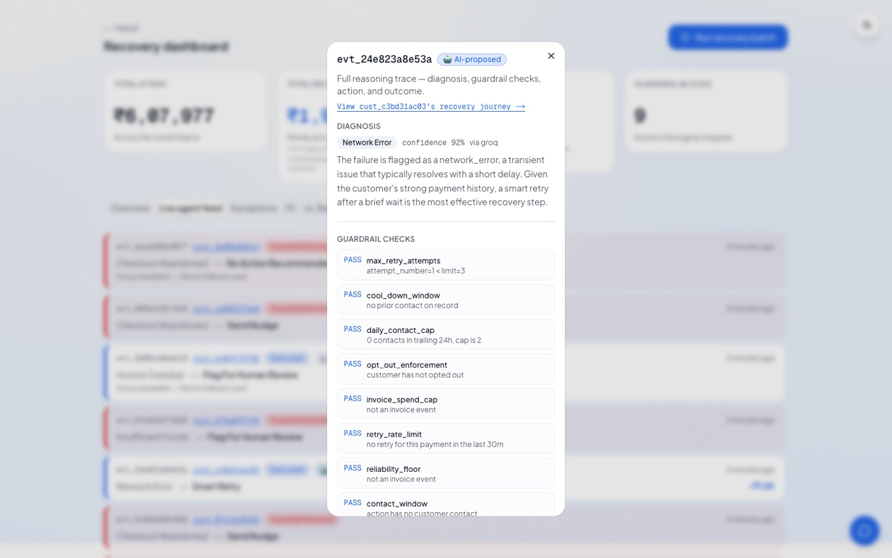
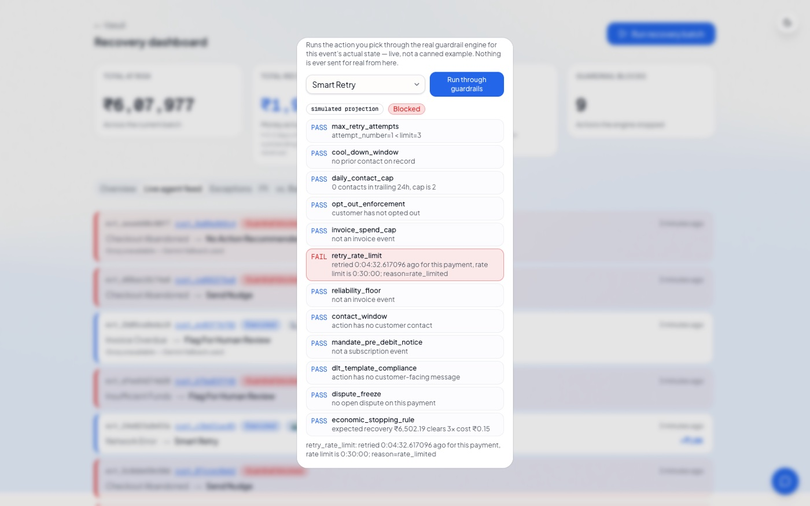
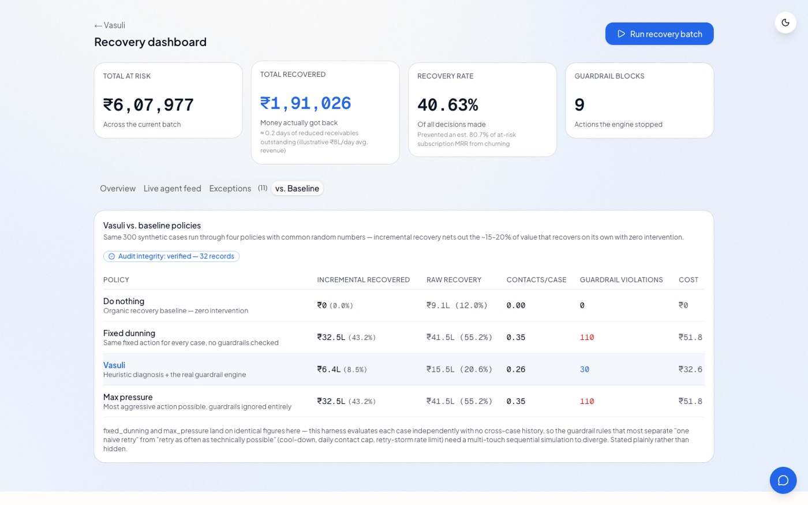
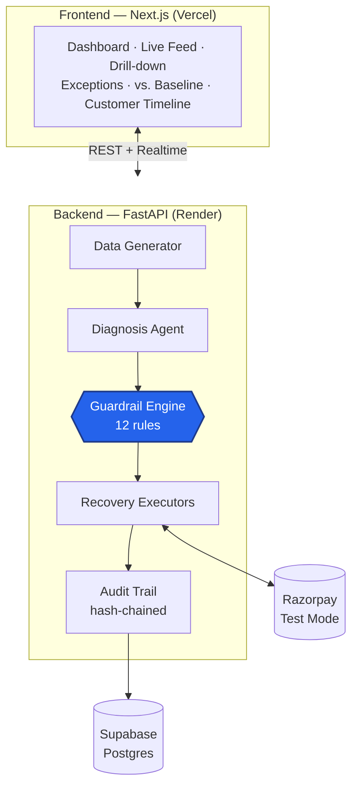

<div align="center">

# Vasuli — the AI agent that gets your money back

**वसूली** (Hindi/Hinglish for *"recovery"*) — an autonomous revenue recovery
agent for Razorpay merchants. It watches failed payments, abandoned
checkouts, failed subscription mandates, and overdue invoices, diagnoses
*why* each one is losing money, picks a bounded action, executes it under
guardrails it can't argue its way past, and reports exactly how much it
got back — and how much it honestly couldn't.

Built for **Razorpay's AI Buildathon, Track 03: AI Revenue Recovery.**

[Architecture deep-dive](docs/architecture.md) · [How it was built (blog)](BLOG.md) · [Quick setup](#get-it-running)



</div>

---

## What it actually does

One sentence a judge should walk away with: **the LLM never touches money
directly.** It only ever gets to *propose*. A separate, 100% deterministic
layer — 12 plain Python rules, zero AI — decides whether that proposal is
allowed to run, and a third layer is the only thing allowed to actually run
it. Every decision, blocked or executed, is written to a tamper-evident
audit trail.



## See it working

| | |
|---|---|
|  **Live agent feed** — every decision streams in as it happens, badged by source (🤖 AI-proposed / ⚙️ guardrail-blocked / 📐 heuristic-fallback) |  **Full reasoning trace** — root cause, confidence, every guardrail check pass/fail, action, outcome |
|  **Counterfactual sandbox** — pick a *different* action and watch the real guardrail engine judge it live (here: caught a repeat retry that would've violated the 30-minute rate limit) |  **vs. Baseline** — the same batch run through 4 policies with common random numbers, headline number is *incremental* recovery, plus a live hash-chain integrity badge |

Full walkthrough with narration: **[BLOG.md](BLOG.md)**.

## Why this exists — the track's actual bar

Track 03 is explicit: *"don't just identify the problem — show measured
money recovered across a batch, with compliant escalation, stopping rules,
and an audit trail."* Every clause of that is a literal feature here, not a
slide:

| Bar requirement | How Vasuli satisfies it |
|---|---|
| Measured money recovered across a batch | KPI row computed live from the current batch — ₹ recovered, recovery rate, exposure |
| Baseline-compared, not just raw recovery | Evaluation harness: `do_nothing` / `fixed_dunning` / `vasuli` / `max_pressure`, common random numbers, **incremental** recovery is the headline |
| Compliant escalation | Opt-outs, contact-frequency caps, and named regulatory constraints (RBI contact hours, e-mandate notice, TRAI DLT templates) |
| Stopping rules | 12-rule guardrail engine, including an economic stopping rule that forces restraint when an action costs more than it could plausibly recover |
| Audit trail | Every decision hash-chained — tampering with any past record is provably detectable, not just logged |
| Honest exceptions | A dedicated "could not recover" list with reasons, never hidden |

## What makes this different from a typical hackathon agent

Six things beyond the baseline, each a real feature, not a README claim:

- **Decision-source badges** — every single decision, everywhere it renders, is labeled 🤖 AI-proposed / ⚙️ guardrail-blocked / 📐 heuristic-fallback, so the "LLM never touches money" claim is visible by scrolling, not something you have to take on faith.
- **Live pause/resume kill switch** — a batch run can be paused *between* events mid-run, with a visible "Paused — N of M processed" state and nothing silently dropped.
- **Cash-flow framing** — recovered ₹ translated into "≈N days of reduced receivables outstanding" and "% of at-risk subscription MRR prevented from churning," the language a CFO actually uses.
- **Per-customer recovery journey** — click any customer and see their whole story as a timeline, not a flat table row.
- **Counterfactual override sandbox** — try a different action than the one the agent picked, live, against the real guardrail engine — screenshot above.
- **Fairness/consistency check** — a statistical check comparing action-assignment rates across language, channel, and tenure segments, reported honestly either way. None of the comparable projects in this track check for this at all.

## Architecture



Full request-flow walkthrough, sequence diagram, data model, and API
reference: **[docs/architecture.md](docs/architecture.md)**.

## The guardrail engine — 12 rules, zero LLM calls

Every rule runs on every proposed action — pass or fail, both get written
to the audit trail.

| Rule | Regulatory / policy basis |
|---|---|
| Max retry attempts | Card network rules cap retries on a declined instrument |
| Cool-down window | RBI fair-practice codes — no repeat contact within 4h |
| Daily contact cap | RBI fair-practice codes — max 2 touches/customer/24h |
| Opt-out enforcement | TRAI DND registry + the customer's own opt-out flag |
| Spend/amount cap | Invoices over ₹1,00,000 flagged for human review only |
| Retry rate limit | Prevents retry storms — see [the failure story](BLOG.md#the-2am-bug) |
| Reliability floor (B2B) | Chase tone tiered by historical payment reliability |
| Contact window | RBI recovery-agent guidelines — 08:00–19:00 IST only |
| E-mandate pre-debit notice | RBI e-mandate framework — no silent auto-debit retries |
| DLT template compliance | TRAI-mandated pre-registered SMS/WhatsApp templates only |
| Dispute freeze | Any disputed payment hard-stops all further action |
| Economic stopping rule | Forces restraint when expected recovery < 3× action cost |

Covered by [`test_guardrails.py`](backend/tests/test_guardrails.py) (every
rule, pass + block case) and an **adversarial test**
([`test_guardrails_adversarial.py`](backend/tests/test_guardrails_adversarial.py)):
a stub agent recommending the worst legal action for every case across 3
seeds — 240/240 blocked, zero disallowed actions ever reach the executor.

## Proof, not claims

- **Three-way LLM degradation** — Groq (primary) → Gemini (auto-fallback) → a zero-API-key deterministic heuristic agent if both fail. This has fired for real during development, not just in theory.
- **Incremental recovery, not raw** — ~15–20% of at-risk value in this dataset comes back with *zero* intervention; counting that as the agent's win is the easiest way for a recovery product to flatter itself. The evaluation harness nets it out. Reproduce: `python -m app.eval.run_comparison --cases 500 --seed 42`.
- **Hash-chained audit trail** — `python -m app.audit.verify` walks the chain and fails loudly at the first tampered record. Proven by a test that tampers with a row on purpose and confirms it's caught at the exact position.
- **A real 2am bug, found and fixed** — an early retry executor with no rate limit made recovery *worse*, not better, caught by the system's own audit trail. Full story: [BLOG.md](BLOG.md#the-2am-bug).

## Tech stack

100% free tier, no paid signups anywhere.

| Layer | Choice |
|---|---|
| Frontend | Next.js (App Router) + TypeScript, Tailwind, shadcn/ui |
| Backend | FastAPI (Python 3.11+) |
| LLM | Groq (primary) → Gemini (fallback) → deterministic heuristic (last resort) |
| Database | Supabase Postgres + Realtime |
| Payments | Razorpay Test Mode API — real payment links, zero cost |
| Hosting | Vercel (frontend), Render free tier (backend) |

## Get it running

```bash
# Backend
cd backend
python3 -m venv .venv && source .venv/bin/activate
pip install -r requirements.txt
cp ../.env.example ../.env      # fill in Supabase / Groq / Gemini / Razorpay keys
python -m pytest -q             # 125 tests, all deterministic — no live keys needed
uvicorn app.api.main:app --reload
```

```bash
# Frontend, in a second terminal
cd frontend
npm install
cp ../.env.example .env.local   # fill in NEXT_PUBLIC_* Supabase + API base URL
npm run dev
```

**Database:** run the migrations in `supabase/migrations/` in order, against
a free Supabase project (SQL editor or `supabase db push`). See
[`.env.example`](.env.example) for the full environment variable list — all
four providers are free tier, no credit card required.

## Repo layout

```
vasuli-ai/
├── README.md
├── BLOG.md                  # how it was built, with screenshots
├── docs/
│   ├── architecture.md      # full system walkthrough, sequence diagram, API reference
│   └── images/               # screenshots used in this README + the blog
├── backend/app/
│   ├── data/                 # event schema + synthetic generator
│   ├── guardrails/            # deterministic rule engine — 12 rules
│   ├── agents/                 # diagnosis agent, heuristic fallback, Groq/Gemini client
│   ├── recovery/                # executors, outcome model, cost model, Razorpay client
│   ├── audit/                    # decision logger, hash chain, verify CLI, metrics
│   ├── eval/                      # baseline-comparison harness + fairness check
│   └── api/                        # FastAPI routes + batch pipeline
├── backend/tests/                  # 125 tests
├── supabase/migrations/            # SQL schema — events, decisions, hash chain, metrics views
└── frontend/                       # dashboard, live feed, drill-down, exceptions, vs. baseline
```

## Status & known limits

The full pipeline runs end-to-end against real infrastructure: generate →
diagnose (with three-way degradation) → guardrail-check (12 rules) →
execute (real Razorpay Test Mode links, not placeholders) → write a
hash-chained decision → push to the live feed over Supabase Realtime.
Covered by 125 passing tests including an adversarial guardrail test and a
full hash-chain tamper-detection test.

- Render's free tier cold-starts after ~15 minutes idle — hit `/health` a few minutes before judging.
- All comms channels (WhatsApp/SMS/email) are simulated in-UI, clearly labeled as such.
- Single-merchant demo: no auth/multi-tenancy.
- The hash chain and the evaluation harness both assume a single sequential writer — a stated scope cut, not an oversight (see `docs/architecture.md`).

## What to read next

- **[docs/architecture.md](docs/architecture.md)** — the full technical walkthrough: request flow, data model, API surface, sequence diagram.
- **[BLOG.md](BLOG.md)** — the build story, with screenshots and the honest failure-and-fix narrative.
